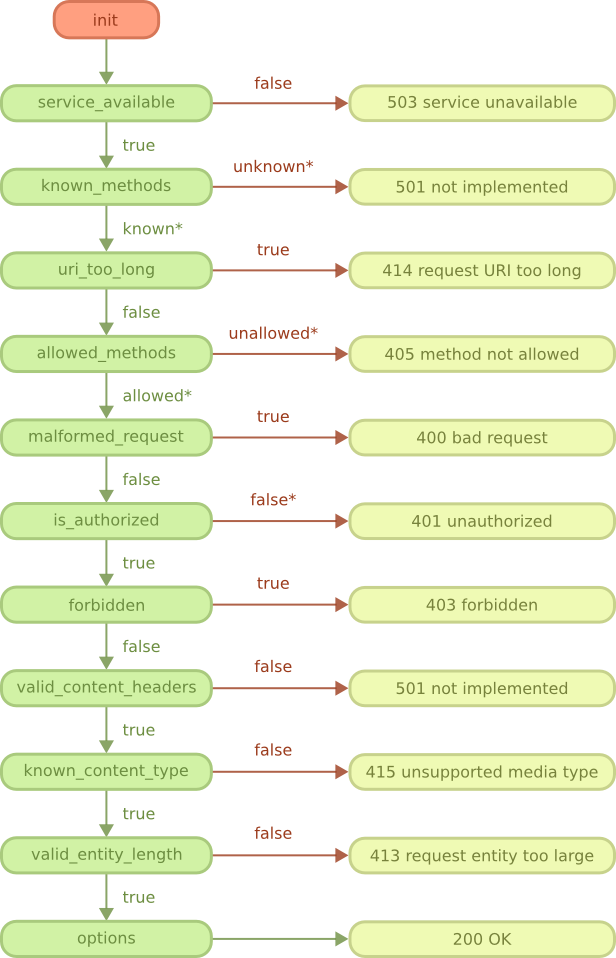
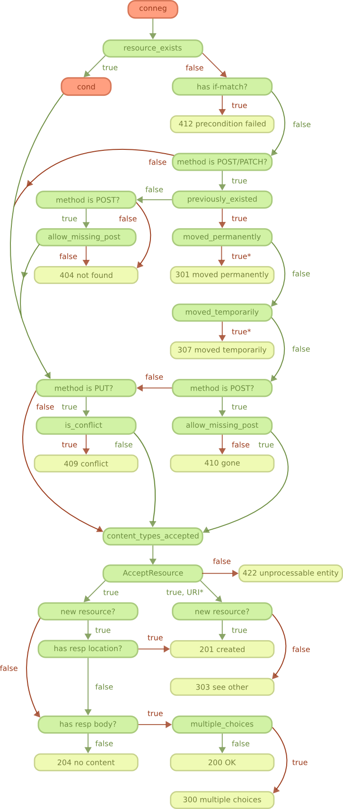
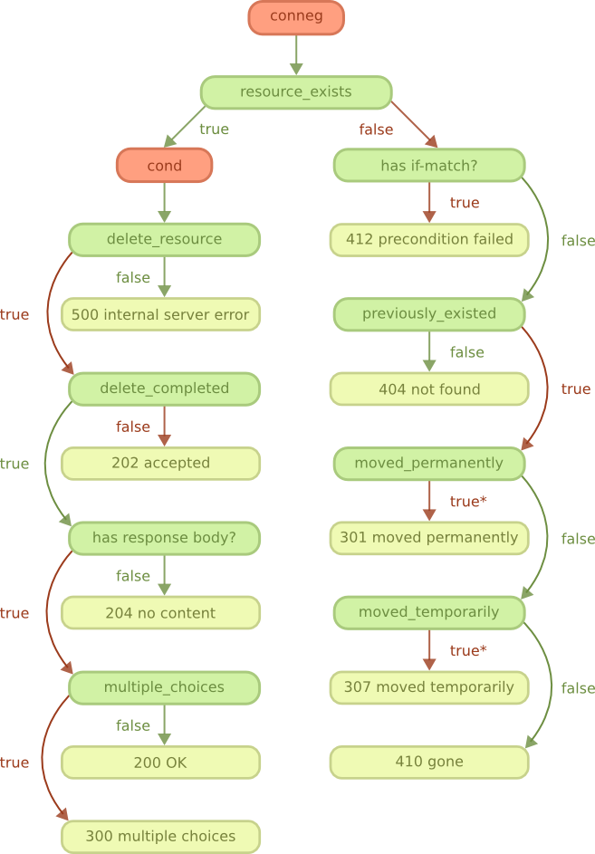

REST flowcharts
===============

This chapter will explain the REST handler state machine through
a number of different diagrams.

This chapter is still under construction.

Start
-----

OPTIONS method
--------------

Content negotiation
-------------------

GET and HEAD methods
--------------------

PUT, POST and PATCH methods
---------------------------

DELETE method
-------------

Conditional requests
--------------------

